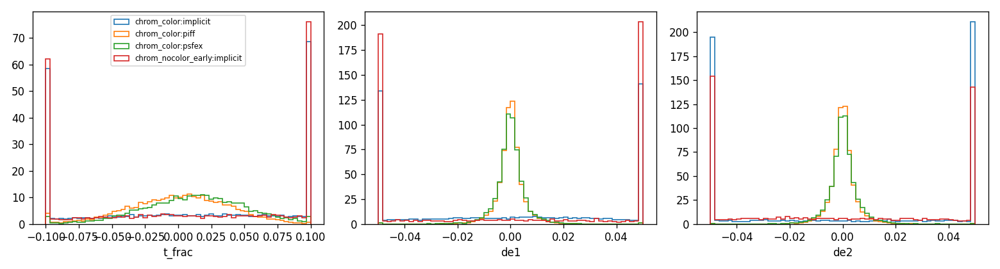
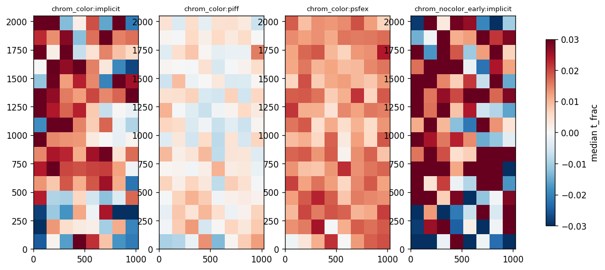
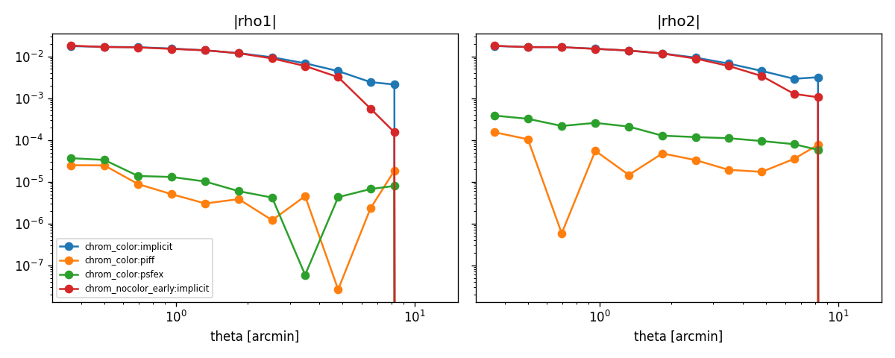

# PSF model comparison report

## Reserved-star metrics (per run and method)

| run                 | method   |   n_stars |   n_exposures |   t_frac_median |   t_frac_scatter |   de1_median |   de2_median |   de_scatter |   chi2_median |
|:--------------------|:---------|----------:|--------------:|----------------:|-----------------:|-------------:|-------------:|-------------:|--------------:|
| chrom_color         | implicit |     11263 |           336 |         0.01246 |          0.11809 |      0.00310 |      0.00325 |      0.06447 |      19.36607 |
| chrom_color         | piff     |     11263 |           336 |         0.00205 |          0.03782 |      0.00005 |      0.00002 |      0.00300 |       3.61806 |
| chrom_color         | psfex    |     11263 |           336 |         0.01343 |          0.03855 |     -0.00004 |      0.00010 |      0.00343 |       4.07739 |
| chrom_nocolor_early | implicit |      5034 |           150 |         0.01310 |          0.12677 |      0.00251 |     -0.00434 |      0.06813 |      19.41957 |

## Paired differences vs PIFF (bootstrap over exposures, 95% CI)

| run         | method   | metric               |   difference |   ci_low |   ci_high |   n_exposures |
|:------------|:---------|:---------------------|-------------:|---------:|----------:|--------------:|
| chrom_color | implicit | mean |t_frac| - piff |     0.074281 | 0.069600 |  0.079047 |           336 |
| chrom_color | psfex    | mean |t_frac| - piff |     0.002206 | 0.001801 |  0.002619 |           336 |
| chrom_color | implicit | mean |de1| - piff    |     0.052104 | 0.049832 |  0.054336 |           336 |
| chrom_color | psfex    | mean |de1| - piff    |     0.000359 | 0.000273 |  0.000449 |           336 |
| chrom_color | implicit | mean |de2| - piff    |     0.087489 | 0.082959 |  0.091863 |           336 |
| chrom_color | psfex    | mean |de2| - piff    |     0.000428 | 0.000292 |  0.000560 |           336 |

