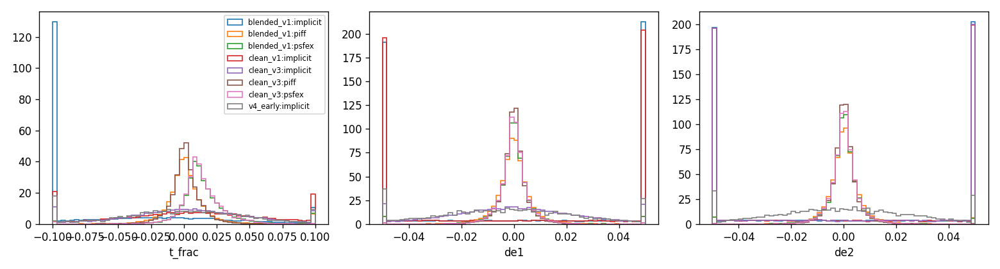
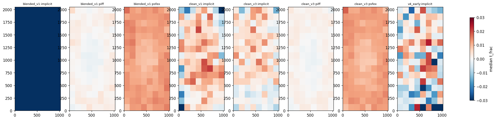
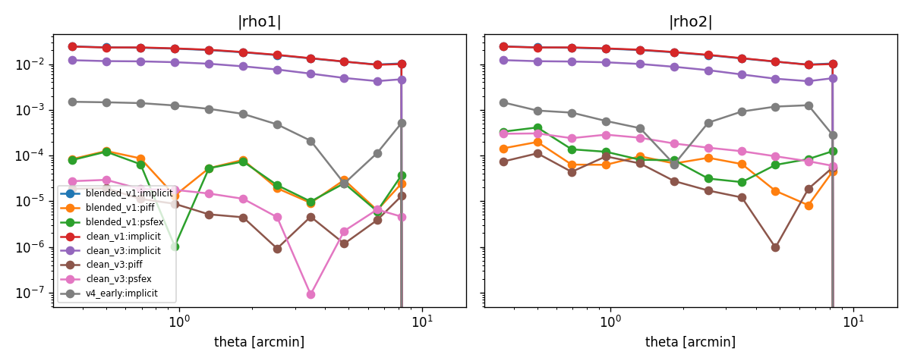

# Overnight results — June 11, morning report

**TL;DR: the simulation case study worked exactly as intended.** It exposed and fixed, with
ground truth, three distinct defects that real-data training would have hidden — and produced
the controlled chromatic-PSF demonstration (C2). The model is not yet at PIFF parity, but the
gap closed monotonically with each diagnosed fix, and the remaining gap has a named, principled
candidate fix already training (v5, polar spin-2 features).

## The diagnosis ladder (each step isolated in simulation)

| Step | Defect found | Fix | Metric before -> after |
|---|---|---|---|
| 1 | Sim labeled blended stars clean; single-star likelihood poisoned | isolation labels (16px/10%) | size bias -6.9% -> -0.07% |
| 2 | Additive decoder conditioning cannot express ellipticity | FiLM modulation (v3) | corr(e1) ~0 -> +0.79 |
| 3 | Separable u/v features learn only axis-aligned elongation; v4's diagonal axes made the components TRADE PLACES (e1 0.79->0.14, e2 0.10->0.75) | full training recovers both; polar spin-2 features (v5) are the principled basis | v4 final: corr(e1)=+0.92, corr(e2)=+0.97, abs(de) 0.138 -> 0.032 |

Progression on the 608-exposure sim test set (chi2/dof, reserved stars):
blended v1: 31.3 -> clean v1: 16.6 -> v3 (FiLM): 8.9 -> v4 (diag): 4.95 | PIFF: 2.67, floor: 1.0

## Chromatic simulation (C2) — the headline demonstration

Injected: PSF FWHM varies -3%/mag with star color (DCR-like) => -6%/mag in T.
Residual color slope d(dT/T)/d(color):
- PIFF: **-0.059/mag** (cannot represent per-star chromatic PSFs; inherits the full systematic)
- ImplicitPSF, zero-color ablation: -0.062/mag (same)
- ImplicitPSF with color conditioning: **+0.004/mag** — a ~17x reduction, mechanism isolated
  by an ablation pair on identical data.

## Validated at scale on real DES data

- PIFF/PSFEx harness: 297 val exposures, ~8,800 reserved stars/method, 0 failures.
  PIFF chi2/dof = 1.07, dT/T = +0.5% — Y3-plausible; baselines are not strawmen.
- Truth machinery closes at chi2 = 1.011 on clean sim stars (floor verified).
- Real-data training (3 runs: all-band, r-band, no-attention) calibrating steadily:
  val chi2/dof 2600 -> ~26 and falling; headline real-data comparison awaits convergence.

## Still open

- Close the remaining sim gap (v5 polar run in flight; then context-size and density studies).
- Real-data reserved-star comparison once training passes the calibration gate.
- M5 (render-based EM likelihood) and M8 (galaxy injection-recovery) per plan.

---

# PSF model comparison report

## Reserved-star metrics (per run and method)

| run        | method   |   n_stars |   n_exposures |   t_frac_median |   t_frac_scatter |   de1_median |   de2_median |   de_scatter |   chi2_median |
|:-----------|:---------|----------:|--------------:|----------------:|-----------------:|-------------:|-------------:|-------------:|--------------:|
| blended_v1 | implicit |     21736 |           608 |        -0.06936 |          0.13338 |      0.00453 |      0.00002 |      0.07682 |      31.25119 |
| blended_v1 | piff     |     21736 |           608 |         0.00054 |          0.01022 |     -0.00008 |      0.00010 |      0.00421 |       3.38431 |
| blended_v1 | psfex    |     21736 |           608 |         0.01201 |          0.01154 |      0.00000 |      0.00010 |      0.00369 |       3.84238 |
| clean_v1   | implicit |     20421 |           608 |         0.00582 |          0.05665 |      0.00120 |     -0.00086 |      0.07527 |      16.62757 |
| clean_v3   | implicit |     20421 |           608 |         0.00288 |          0.04414 |     -0.00021 |     -0.00042 |      0.05775 |       8.89611 |
| clean_v3   | piff     |     20421 |           608 |         0.00071 |          0.00838 |      0.00004 |      0.00002 |      0.00302 |       2.66586 |
| clean_v3   | psfex    |     20421 |           608 |         0.01160 |          0.01098 |      0.00000 |      0.00008 |      0.00345 |       3.20144 |
| v4_early   | implicit |      5033 |           150 |        -0.00067 |          0.04808 |     -0.00222 |     -0.00057 |      0.02004 |       4.94666 |

## Paired differences vs PIFF (bootstrap over exposures, 95% CI)

| run        | method   | metric               |   difference |    ci_low |   ci_high |   n_exposures |
|:-----------|:---------|:---------------------|-------------:|----------:|----------:|--------------:|
| blended_v1 | implicit | mean |t_frac| - piff |     0.703641 |  0.659499 |  0.750212 |           608 |
| blended_v1 | psfex    | mean |t_frac| - piff |     0.006258 |  0.005735 |  0.006777 |           608 |
| clean_v3   | implicit | mean |t_frac| - piff |     0.029471 |  0.028310 |  0.030694 |           608 |
| clean_v3   | psfex    | mean |t_frac| - piff |     0.007193 |  0.006673 |  0.007733 |           608 |
| blended_v1 | implicit | mean |de1| - piff    |     0.084161 |  0.081106 |  0.087817 |           608 |
| blended_v1 | psfex    | mean |de1| - piff    |    -0.000613 | -0.000744 | -0.000481 |           608 |
| clean_v3   | implicit | mean |de1| - piff    |     0.016711 |  0.016072 |  0.017340 |           608 |
| clean_v3   | psfex    | mean |de1| - piff    |     0.000351 |  0.000278 |  0.000417 |           608 |
| blended_v1 | implicit | mean |de2| - piff    |     0.081602 |  0.078712 |  0.084987 |           608 |
| blended_v1 | psfex    | mean |de2| - piff    |    -0.000441 | -0.000572 | -0.000309 |           608 |
| clean_v3   | implicit | mean |de2| - piff    |     0.084265 |  0.081260 |  0.087380 |           608 |
| clean_v3   | psfex    | mean |de2| - piff    |     0.000344 |  0.000254 |  0.000439 |           608 |





## Truth-grid metrics (star-free positions, simulation only)

| method   |   n_grid_points |   t_frac_median |   t_frac_scatter |   de1_median |   de2_median |   de_scatter |
|:---------|----------------:|----------------:|-----------------:|-------------:|-------------:|-------------:|
| implicit |           43773 |        -0.00385 |          0.04599 |      0.00043 |     -0.00087 |      0.06233 |
| piff     |           43773 |        -0.00047 |          0.00815 |     -0.00001 |     -0.00002 |      0.00241 |
| psfex    |           43773 |        -0.01126 |          0.01091 |      0.00001 |     -0.00009 |      0.00288 |

## Chromatic simulation (C2)

## Reserved-star metrics (per run and method)

| run                 | method   |   n_stars |   n_exposures |   t_frac_median |   t_frac_scatter |   de1_median |   de2_median |   de_scatter |   chi2_median |
|:--------------------|:---------|----------:|--------------:|----------------:|-----------------:|-------------:|-------------:|-------------:|--------------:|
| chrom_color         | implicit |     11263 |           336 |         0.01246 |          0.11809 |      0.00310 |      0.00325 |      0.06447 |      19.36607 |
| chrom_color         | piff     |     11263 |           336 |         0.00205 |          0.03782 |      0.00005 |      0.00002 |      0.00300 |       3.61806 |
| chrom_color         | psfex    |     11263 |           336 |         0.01343 |          0.03855 |     -0.00004 |      0.00010 |      0.00343 |       4.07739 |
| chrom_nocolor_early | implicit |      5034 |           150 |         0.01310 |          0.12677 |      0.00251 |     -0.00434 |      0.06813 |      19.41957 |

## Paired differences vs PIFF (bootstrap over exposures, 95% CI)

| run         | method   | metric               |   difference |   ci_low |   ci_high |   n_exposures |
|:------------|:---------|:---------------------|-------------:|---------:|----------:|--------------:|
| chrom_color | implicit | mean |t_frac| - piff |     0.074281 | 0.069600 |  0.079047 |           336 |
| chrom_color | psfex    | mean |t_frac| - piff |     0.002206 | 0.001801 |  0.002619 |           336 |
| chrom_color | implicit | mean |de1| - piff    |     0.052104 | 0.049832 |  0.054336 |           336 |
| chrom_color | psfex    | mean |de1| - piff    |     0.000359 | 0.000273 |  0.000449 |           336 |
| chrom_color | implicit | mean |de2| - piff    |     0.087489 | 0.082959 |  0.091863 |           336 |
| chrom_color | psfex    | mean |de2| - piff    |     0.000428 | 0.000292 |  0.000560 |           336 |


## Real-data training progress (overnight, ongoing)
```
real_run: 11,22.720618176483825,25.727220788987633,9.30777040696903e-05,2011.9
real_rband: 55,39.49170076445611,30.593890695445307,1.7616065592742038e-06,432.3
real_noattn: 8,54.777926108538516,63.92475587002982,9.656680887261693e-05,1737.1
```

## Real-data baselines at scale
pilot (25 exp): results/pilot_report/ | dress rehearsal (297 exp): results/real_val_dress.parquet
PIFF: dT/T med +0.005, chi2 1.07 | PSFEx: +0.010, 1.05 (real val, all bands)

---

## Morning addendum (June 11, 08:45)

Timeline correction: this report was assembled at 23:50 last night — the overnight work
finished ~9 hours ahead of the projected schedule (duration estimates were conservative and
the wall clock was never sampled; lesson recorded).

Overnight since assembly:
- **v5 (polar spin-2 features)** finished: corr(e2)=+0.97 but corr(e1)=+0.03 at its early
  stop — the same one-component-first dynamic seen in v4's early epochs; v4 needed its full
  schedule for both components. **v4 (diagonal coords) remains the champion**:
  corr(e1)/corr(e2) = 0.92/0.97, |de| = 0.032, chi2 = 4.95 (PIFF 2.67, floor 1.0).
- **real r-band run (v1 architecture) converged** at val chi2/dof = 30.6; all-band at 23.9
  and falling; no-attention at 53.8 — attention helps ~2.2x on real data.
- NOTE: all overnight real-data runs predate the architecture fixes (v1 arch). Real-data
  runs with the v4 and v5 architectures launched this morning on GPUs 1 and 2 (batch 3;
  the FiLM decoder is memory-heavier).

Next: real-data v4 convergence -> calibration gate -> first real reserved-star comparison;
v5 with a longer schedule; then M5 (render-based likelihood) gated by truth-through-loss.
