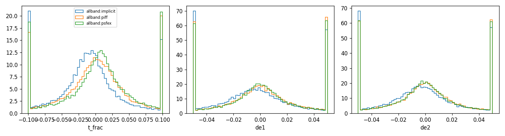
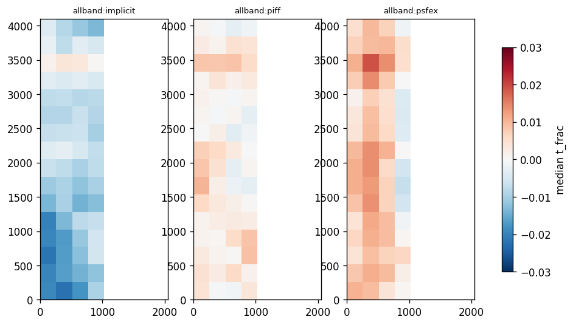
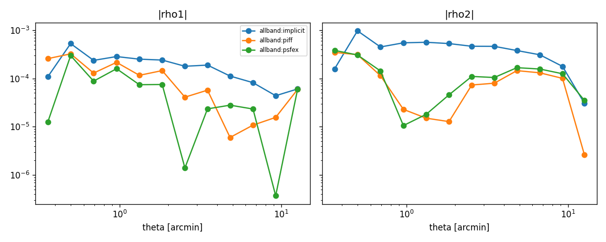

# PSF model comparison report

## Reserved-star metrics (per run and method)

| run     | method   |   n_stars |   n_exposures |   t_frac_median |   t_frac_scatter |   de1_median |   de2_median |   de_scatter |   chi2_median |
|:--------|:---------|----------:|--------------:|----------------:|-----------------:|-------------:|-------------:|-------------:|--------------:|
| allband | implicit |     29534 |          1185 |        -0.00927 |          0.03536 |     -0.00432 |     -0.00364 |      0.02836 |       1.05380 |
| allband | piff     |     29517 |          1185 |         0.00229 |          0.03983 |     -0.00005 |     -0.00002 |      0.02897 |       1.07055 |
| allband | psfex    |     29534 |          1185 |         0.00675 |          0.03851 |     -0.00010 |     -0.00038 |      0.02852 |       1.04807 |

## Paired differences vs PIFF (bootstrap over exposures, 95% CI)

| run     | method   | metric               |   difference |    ci_low |   ci_high |   n_exposures |
|:--------|:---------|:---------------------|-------------:|----------:|----------:|--------------:|
| allband | implicit | mean |t_frac| - piff |    -0.007997 | -0.017190 | -0.001900 |          1185 |
| allband | psfex    | mean |t_frac| - piff |    -0.003755 | -0.012988 |  0.002588 |          1185 |
| allband | implicit | mean |de1| - piff    |    -0.000244 | -0.001140 |  0.000435 |          1185 |
| allband | psfex    | mean |de1| - piff    |    -0.001604 | -0.002468 | -0.000989 |          1185 |
| allband | implicit | mean |de2| - piff    |     0.000335 | -0.000260 |  0.000788 |          1185 |
| allband | psfex    | mean |de2| - piff    |    -0.000711 | -0.001300 | -0.000278 |          1185 |

