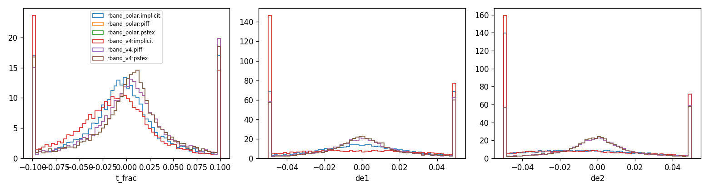
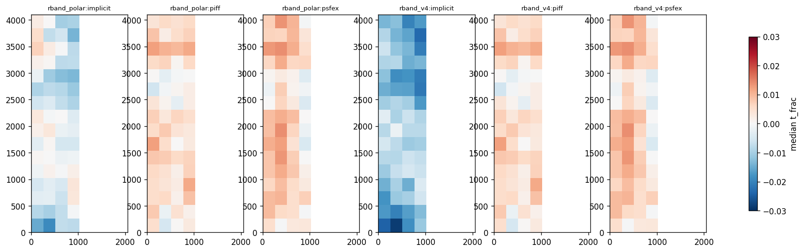
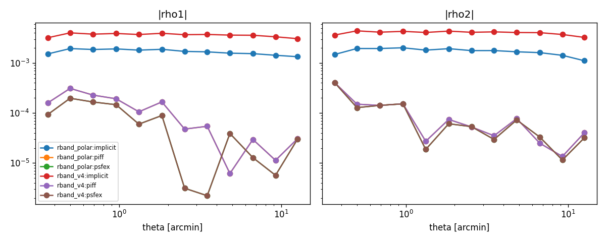

# PSF model comparison report

## Reserved-star metrics (per run and method)

| run         | method   |   n_stars |   n_exposures |   t_frac_median |   t_frac_scatter |   de1_median |   de2_median |   de_scatter |   chi2_median |
|:------------|:---------|----------:|--------------:|----------------:|-----------------:|-------------:|-------------:|-------------:|--------------:|
| rband_polar | implicit |     17628 |           683 |        -0.00417 |          0.03508 |     -0.00034 |     -0.01226 |      0.03657 |       1.06807 |
| rband_polar | piff     |     17618 |           683 |         0.00438 |          0.03660 |      0.00039 |     -0.00001 |      0.02744 |       1.08715 |
| rband_polar | psfex    |     17628 |           683 |         0.00597 |          0.03397 |      0.00033 |     -0.00016 |      0.02696 |       1.05920 |
| rband_v4    | implicit |     17628 |           683 |        -0.01214 |          0.04176 |     -0.00942 |     -0.01540 |      0.04168 |       1.07714 |
| rband_v4    | piff     |     17618 |           683 |         0.00438 |          0.03660 |      0.00039 |     -0.00001 |      0.02744 |       1.08715 |
| rband_v4    | psfex    |     17628 |           683 |         0.00597 |          0.03397 |      0.00033 |     -0.00016 |      0.02696 |       1.05920 |

## Paired differences vs PIFF (bootstrap over exposures, 95% CI)

| run         | method   | metric               |   difference |    ci_low |   ci_high |   n_exposures |
|:------------|:---------|:---------------------|-------------:|----------:|----------:|--------------:|
| rband_polar | implicit | mean |t_frac| - piff |    -0.005391 | -0.010696 | -0.001423 |           683 |
| rband_polar | psfex    | mean |t_frac| - piff |    -0.003482 | -0.008587 |  0.000371 |           683 |
| rband_v4    | implicit | mean |t_frac| - piff |    -0.001290 | -0.006598 |  0.002788 |           683 |
| rband_v4    | psfex    | mean |t_frac| - piff |    -0.003482 | -0.008732 |  0.000511 |           683 |
| rband_polar | implicit | mean |de1| - piff    |     0.002772 |  0.001805 |  0.003597 |           683 |
| rband_polar | psfex    | mean |de1| - piff    |    -0.001661 | -0.002508 | -0.001037 |           683 |
| rband_v4    | implicit | mean |de1| - piff    |     0.016515 |  0.014621 |  0.018526 |           683 |
| rband_v4    | psfex    | mean |de1| - piff    |    -0.001661 | -0.002488 | -0.001045 |           683 |
| rband_polar | implicit | mean |de2| - piff    |     0.014774 |  0.013239 |  0.016388 |           683 |
| rband_polar | psfex    | mean |de2| - piff    |    -0.001062 | -0.001890 | -0.000485 |           683 |
| rband_v4    | implicit | mean |de2| - piff    |     0.017767 |  0.015910 |  0.019523 |           683 |
| rband_v4    | psfex    | mean |de2| - piff    |    -0.001062 | -0.001822 | -0.000492 |           683 |

