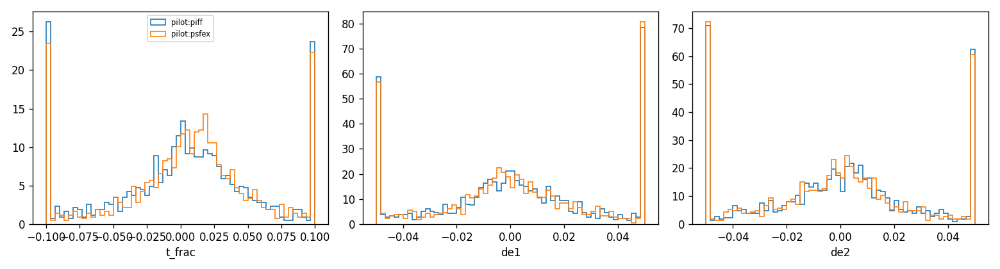
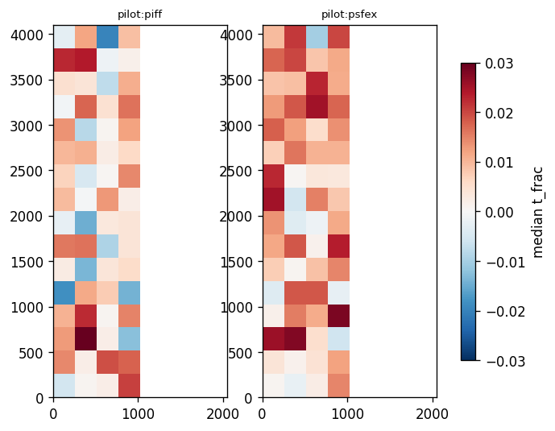
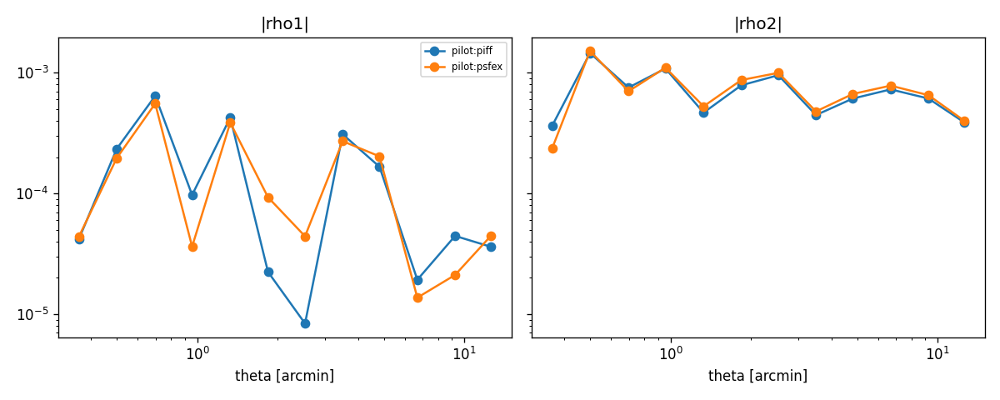

# PSF model comparison report

## Reserved-star metrics (per run and method)

| run   | method   |   n_stars |   n_exposures |   t_frac_median |   t_frac_scatter |   de1_median |   de2_median |   de_scatter |   chi2_median |
|:------|:---------|----------:|--------------:|----------------:|-----------------:|-------------:|-------------:|-------------:|--------------:|
| pilot | piff     |      1278 |            25 |         0.00422 |          0.04490 |      0.00099 |      0.00023 |      0.03094 |       0.97262 |
| pilot | psfex    |      1278 |            25 |         0.00965 |          0.03817 |      0.00106 |     -0.00069 |      0.03083 |       0.96859 |

## Paired differences vs PIFF (bootstrap over exposures, 95% CI)

| run   | method   | metric               |   difference |    ci_low |   ci_high |   n_exposures |
|:------|:---------|:---------------------|-------------:|----------:|----------:|--------------:|
| pilot | psfex    | mean |t_frac| - piff |    -0.003265 | -0.007476 | -0.000250 |            25 |
| pilot | psfex    | mean |de1| - piff    |    -0.000282 | -0.000798 |  0.000325 |            25 |
| pilot | psfex    | mean |de2| - piff    |    -0.000281 | -0.000595 | -0.000034 |            25 |

