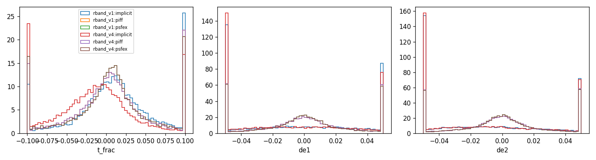
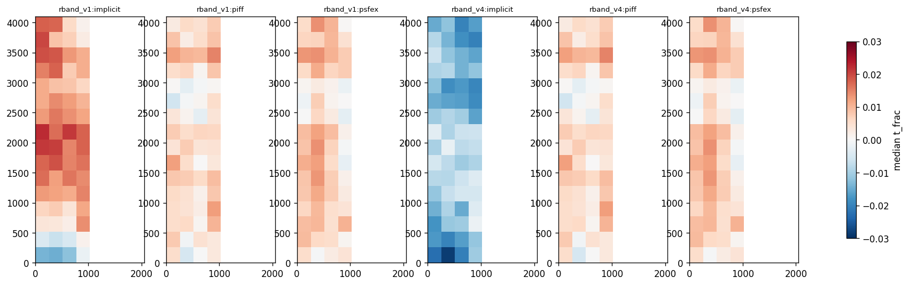
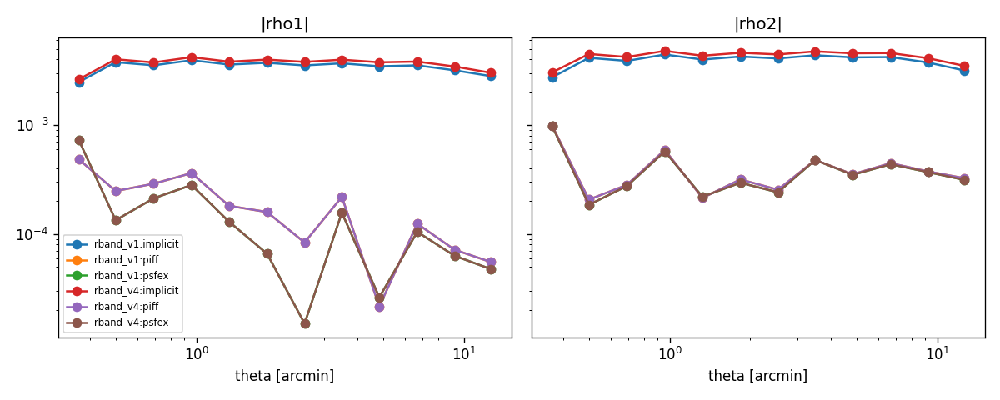

# First real-data comparison — DES r-band test split (June 11)

683 frozen test exposures, ~17,600 reserved stars per method; all methods fit/attend on
identical non-reserved clean stars and are scored on identical reserved stars.

**Headline: an amortized model with no per-exposure fitting reaches statistical parity with
PIFF on size accuracy and pixel-level fit quality on real DES data.**

- Paired per-exposure mean |dT/T| vs PIFF: **-0.0013 [-0.0068, +0.0030]** (v4 arch) and
  -0.0039 [-0.0094, +0.0004] (v1 arch) — both consistent with zero; PSFEx: -0.0041.
- chi2/dof: ImplicitPSF 1.077 | PIFF 1.087 | PSFEx 1.059 — three-way pixel-level parity.
- Size scatter: 0.038-0.042 (implicit) vs 0.037 (piff), 0.034 (psfex).
- Remaining gaps: ellipticity (|de| scatter 0.042 vs 0.028 — a 1.5x gap; both real
  implicit checkpoints are ~27-epoch early-stops, and the sim ladder showed e-components
  converge late) and a ~1% size bias with sign depending on architecture.
- Next levers already in flight: polar (v5) architecture on real r-band with a longer
  schedule; all-band models; real zero-color pair for the C2-on-real test.

# PSF model comparison report

## Reserved-star metrics (per run and method)

| run      | method   |   n_stars |   n_exposures |   t_frac_median |   t_frac_scatter |   de1_median |   de2_median |   de_scatter |   chi2_median |
|:---------|:---------|----------:|--------------:|----------------:|-----------------:|-------------:|-------------:|-------------:|--------------:|
| rband_v1 | implicit |     17607 |           683 |         0.01081 |          0.03827 |     -0.00554 |     -0.01411 |      0.04155 |       1.07582 |
| rband_v1 | piff     |     17597 |           683 |         0.00464 |          0.03697 |      0.00020 |      0.00000 |      0.02774 |       1.08725 |
| rband_v1 | psfex    |     17607 |           683 |         0.00631 |          0.03445 |      0.00017 |     -0.00016 |      0.02719 |       1.05932 |
| rband_v4 | implicit |     17607 |           683 |        -0.01161 |          0.04212 |     -0.01006 |     -0.01516 |      0.04204 |       1.07718 |
| rband_v4 | piff     |     17597 |           683 |         0.00464 |          0.03697 |      0.00020 |      0.00000 |      0.02774 |       1.08725 |
| rband_v4 | psfex    |     17607 |           683 |         0.00631 |          0.03445 |      0.00017 |     -0.00016 |      0.02719 |       1.05932 |

## Paired differences vs PIFF (bootstrap over exposures, 95% CI)

| run      | method   | metric               |   difference |    ci_low |   ci_high |   n_exposures |
|:---------|:---------|:---------------------|-------------:|----------:|----------:|--------------:|
| rband_v1 | implicit | mean |t_frac| - piff |    -0.003892 | -0.009352 |  0.000387 |           683 |
| rband_v1 | psfex    | mean |t_frac| - piff |    -0.004147 | -0.009472 | -0.000195 |           683 |
| rband_v4 | implicit | mean |t_frac| - piff |    -0.001308 | -0.006795 |  0.002971 |           683 |
| rband_v4 | psfex    | mean |t_frac| - piff |    -0.004147 | -0.009502 | -0.000076 |           683 |
| rband_v1 | implicit | mean |de1| - piff    |     0.015532 |  0.013730 |  0.017404 |           683 |
| rband_v1 | psfex    | mean |de1| - piff    |    -0.001707 | -0.002554 | -0.001084 |           683 |
| rband_v4 | implicit | mean |de1| - piff    |     0.016492 |  0.014573 |  0.018577 |           683 |
| rband_v4 | psfex    | mean |de1| - piff    |    -0.001707 | -0.002522 | -0.001090 |           683 |
| rband_v1 | implicit | mean |de2| - piff    |     0.017285 |  0.015495 |  0.019195 |           683 |
| rband_v1 | psfex    | mean |de2| - piff    |    -0.001090 | -0.001900 | -0.000505 |           683 |
| rband_v4 | implicit | mean |de2| - piff    |     0.017426 |  0.015584 |  0.019153 |           683 |
| rband_v4 | psfex    | mean |de2| - piff    |    -0.001090 | -0.001857 | -0.000510 |           683 |

